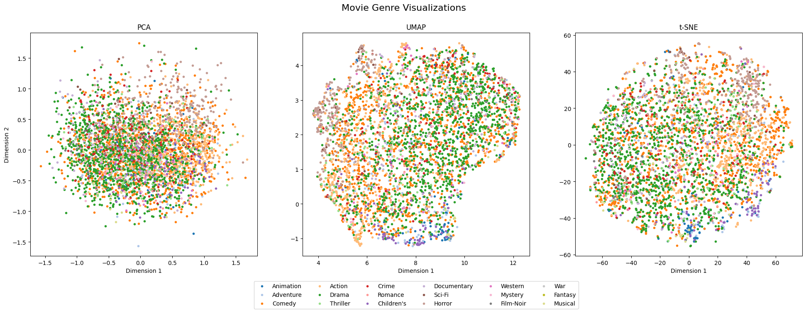
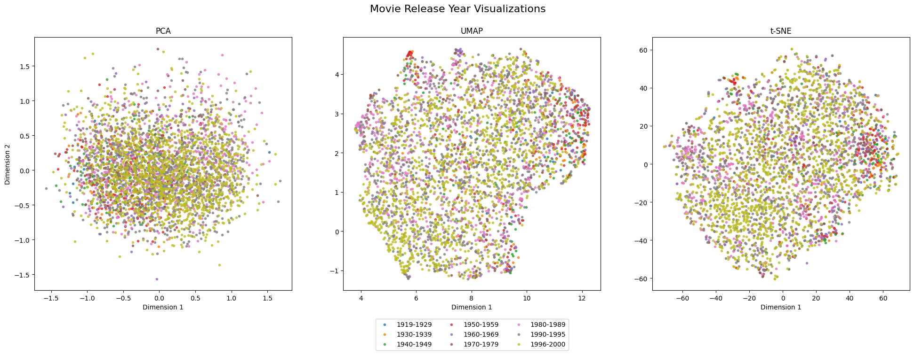
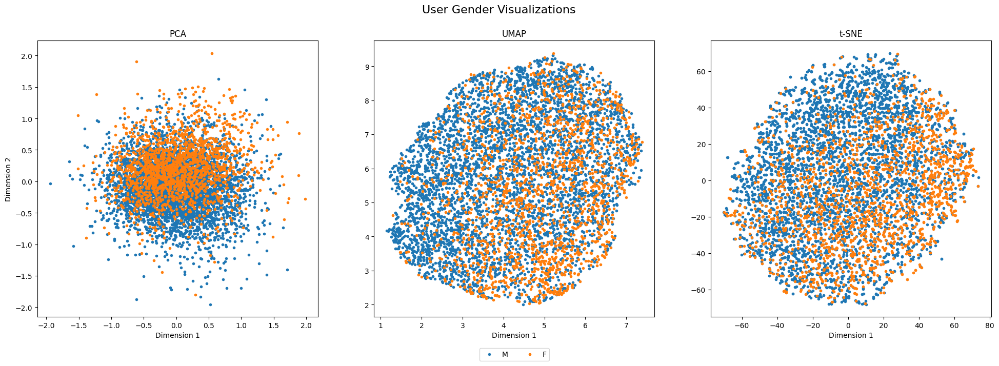
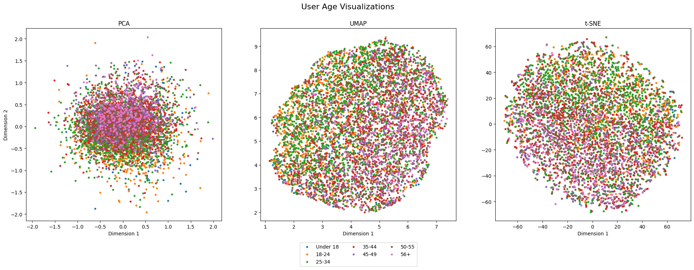

# Various Recommendation Systems

This repository contains coursework code for the Data Mining subject. The code addresses two open-source datasets: the 
1M MovieLens dataset and a stripped-down version of the Netflix challenge dataset. Various recommendation system 
techniques are used, starting from naive approaches and progressing through different implementations of Locality 
Sensitive Hashing.

## Overview

This repository contains implementations of Data Mining techniques, which are organized into two directories. The 1M 
MovieLens dataset was analyzed using the following techniques:
- Naive approaches such as Global Mean Rating
- UV Matrix Decomposition
- Matrix Factorization

Additionally, the high-dimensionality feature matrices were visualized using dimensionality reduction algorithms to 
cluster certain characteristics. The following algorithms were used:
- PCA
- UMAP
- t-SNE

Data file should be placed in `data/` directory.

## Visualizations

All visualizations based on the 1M MovieLens dataset can be found in the visualization notebook.

### Movie Genre

### Movie Release Year

### User Gender

### User Age

## References

- [MovieLens 1M Dataset](https://grouplens.org/datasets/movielens/1m/)
- [Kaggle - Netflix Prize data](https://www.kaggle.com/datasets/netflix-inc/netflix-prize-data)
